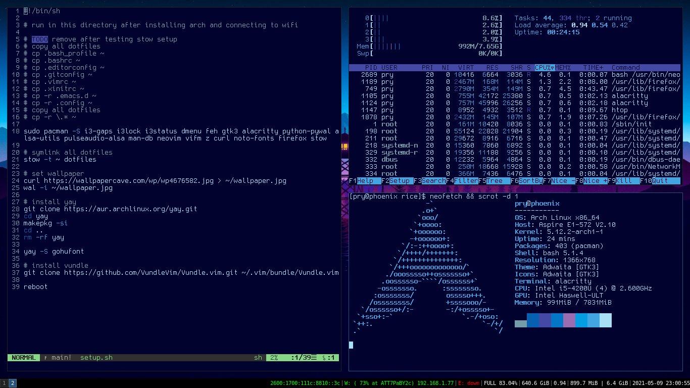

# rice
My Arch Linux config



## My Current Setup
| | |
|-|-|
| **OS** | Arch Linux |
| **Shell** | GNU Bash |
| **WM** | i3 gaps |
| **launcher** | dmenu |
| **text editor** | Neovim |
| **browser** | Firefox |

## Install
1. Run the guided installer for Arch Linux and make sure you choose the "xorg" profile.
2. Make sure you install the following packages during the install as well: `networkmanager` and `git`
3. Set up NetworkManager through the following:
```sh
systemctl enable NetworkManager
systemctl start NetworkManager
nmtui # TUI to activate wifi!!!
```
4. `git clone https://github.com/prydt/rice` and `cd` into the directory
5. run `setup.sh`
6. The script should automatical reboot the computer and it should just work:tm:
